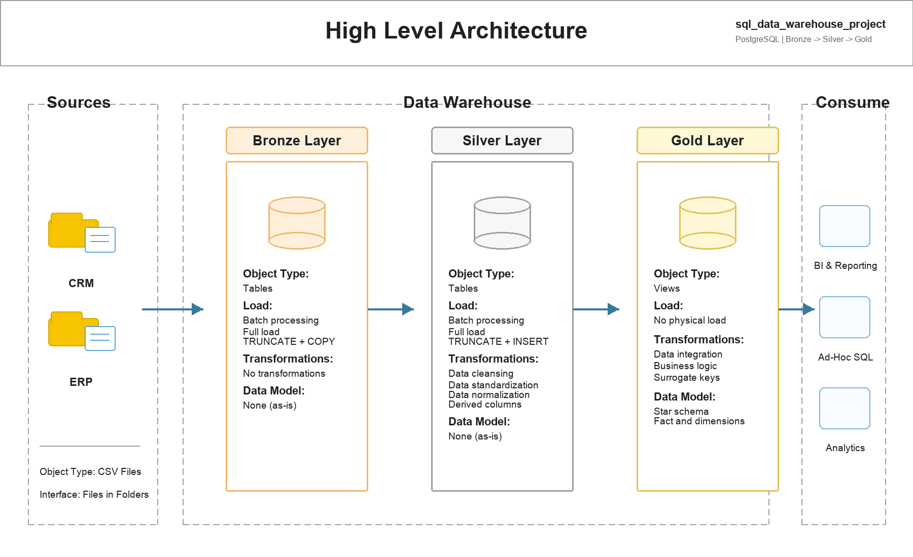
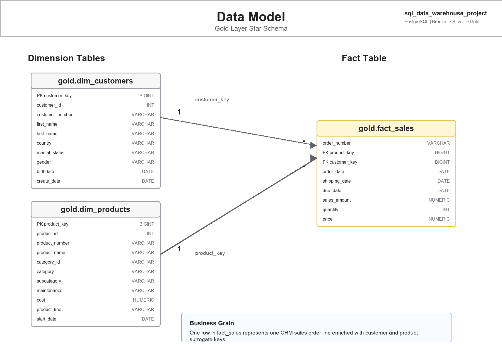
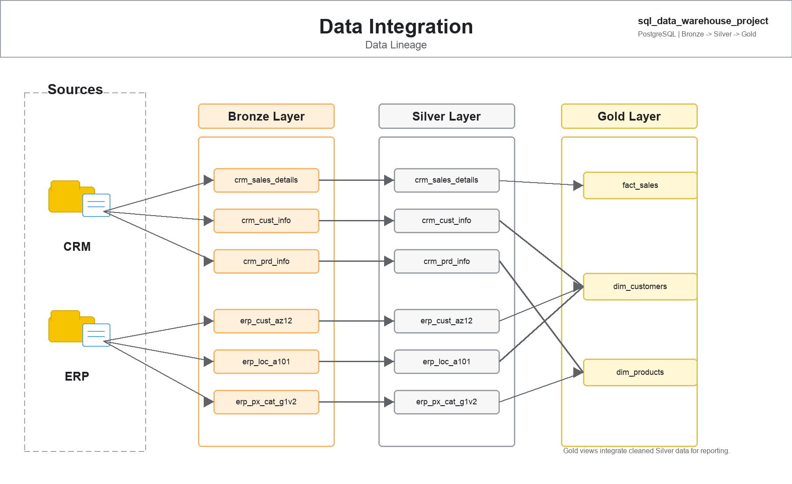

# SQL Data Warehouse Project


This project is a complete modern data warehouse built with **PostgreSQL**. It follows the classic **Bronze, Silver, and Gold** layered architecture to ingest raw CRM and ERP datasets, clean and standardize them, and publish analytics-ready views for reporting.

The project is inspired by the Data With Baraa SQL Data Warehouse course, but this implementation is adapted for PostgreSQL and structured as a portfolio-ready data engineering project.

## Table of Contents

- [Project Overview](#project-overview)
- [Architecture](#architecture)
- [Data Sources](#data-sources)
- [Repository Structure](#repository-structure)
- [Warehouse Layers](#warehouse-layers)
- [Data Model](#data-model)
- [ETL Workflow](#etl-workflow)
- [Data Quality Checks](#data-quality-checks)
- [Analytics Reports](#analytics-reports)
- [How to Run the Project](#how-to-run-the-project)
- [Documentation](#documentation)
- [Skills Demonstrated](#skills-demonstrated)
- [Project Outcome](#project-outcome)
- [Acknowledgement](#acknowledgement)

## Project Overview

The goal of this project is to consolidate sales-related data from multiple operational systems into a clean, integrated, analytics-ready warehouse.

The warehouse supports:

- Loading raw data from CSV files into PostgreSQL.
- Separating raw, cleaned, and business-ready data into dedicated schemas.
- Applying data cleansing, standardization, and transformation logic.
- Building a Gold layer star schema for analytical queries.
- Validating data quality before using the data for reporting.

The final Gold layer provides three business-facing views:

- `gold.dim_customers`
- `gold.dim_products`
- `gold.fact_sales`

These views can be consumed by BI tools, dashboards, ad-hoc SQL analysis, or future analytics projects.

## Architecture

The warehouse follows the **Medallion Architecture** pattern:



### Bronze Layer

The Bronze layer stores source data in its original structure. It is the raw landing zone of the warehouse.

- Source format: CSV files
- Database object type: tables
- Load method: full batch load
- Load pattern: `TRUNCATE` and `COPY`
- Transformation level: none

### Silver Layer

The Silver layer stores cleaned, standardized, and transformed data. It is designed to fix data quality issues before the data becomes available for analytics.

- Database object type: tables
- Load method: full batch load
- Load pattern: `TRUNCATE` and `INSERT`
- Transformation level: cleansing, standardization, normalization, and derived columns

### Gold Layer

The Gold layer contains business-ready views modeled as a star schema.

- Database object type: views
- Load method: no physical load
- Transformation level: business logic, data integration, and analytical modeling
- Data model: fact and dimension views

## Data Sources

The project uses two source systems:

### CRM Source

Located in `datasets/source_crm/`.

| File | Target Bronze Table | Description |
|---|---|---|
| `cust_info.csv` | `bronze.crm_cust_info` | Customer master data from the CRM system. |
| `prd_info.csv` | `bronze.crm_prd_info` | Product master data from the CRM system. |
| `sales_details.csv` | `bronze.crm_sales_details` | Sales order transaction details. |

### ERP Source

Located in `datasets/source_erp/`.

| File | Target Bronze Table | Description |
|---|---|---|
| `CUST_AZ12.csv` | `bronze.erp_cust_az12` | Customer demographic data, including birthdate and gender. |
| `LOC_A101.csv` | `bronze.erp_loc_a101` | Customer location and country data. |
| `PX_CAT_G1V2.csv` | `bronze.erp_px_cat_g1v2` | Product category, subcategory, and maintenance data. |

## Repository Structure

```text
sql_data_warehouse_project/
|
|-- datasets/
|   |-- source_crm/
|   |   |-- cust_info.csv
|   |   |-- prd_info.csv
|   |   `-- sales_details.csv
|   |
|   `-- source_erp/
|       |-- CUST_AZ12.csv
|       |-- LOC_A101.csv
|       `-- PX_CAT_G1V2.csv
|
|-- docs/
|   |-- data_architecture.png
|   |-- data_catalog.md
|   |-- data_integration.png
|   `-- data_model.png
|
|-- scripts/
|   |-- init_database.sql
|   |
|   |-- bronze/
|   |   |-- ddl_bronze.sql
|   |   `-- proc_load_bronze.sql
|   |
|   |-- silver/
|   |   |-- ddl_silver.sql
|   |   `-- proc_load_silver.sql
|   |
|   `-- gold/
|       `-- ddl_gold.sql
|   |
|   `-- analytics/
|       |-- 01_report_customers.sql
|       `-- 02_report_products.sql
|
|-- tests/
|   |-- quality_checks_silver.sql
|   `-- quality_checks_gold.sql
|
`-- README.md
```

## Warehouse Layers

### Bronze Layer

The Bronze layer contains raw tables that match the incoming CSV structures as closely as possible.

CRM tables:

- `bronze.crm_cust_info`
- `bronze.crm_prd_info`
- `bronze.crm_sales_details`

ERP tables:

- `bronze.erp_cust_az12`
- `bronze.erp_loc_a101`
- `bronze.erp_px_cat_g1v2`

The Bronze load procedure is:

```sql
CALL bronze.load_all_bronze_tables();
```

This procedure truncates each Bronze table and reloads it from the CSV files using PostgreSQL `COPY`.

### Silver Layer

The Silver layer contains cleaned versions of the Bronze tables. Each table includes a `dwh_create_date` timestamp to track when the record was loaded into the warehouse.

Silver transformations include:

- Removing duplicate customers and keeping the latest record.
- Trimming unwanted spaces from text columns.
- Standardizing gender values.
- Standardizing marital status values.
- Extracting category IDs from product keys.
- Replacing missing product costs with `0`.
- Standardizing product line codes into readable values.
- Converting integer date fields into proper PostgreSQL `DATE` values.
- Recalculating invalid sales amounts.
- Recalculating invalid unit prices.
- Removing prefixes and hyphens from customer IDs for integration.
- Standardizing country names and country codes.

The Silver load procedure is:

```sql
CALL silver.load_silver();
```

### Gold Layer

The Gold layer contains analytical views built from the Silver layer.

The Gold layer is designed around a star schema:



| View | Type | Description |
|---|---|---|
| `gold.dim_customers` | Dimension | Customer attributes enriched with ERP demographic and country data. |
| `gold.dim_products` | Dimension | Product attributes enriched with category and maintenance details. |
| `gold.fact_sales` | Fact | Sales transactions linked to customer and product dimensions. |

## Data Model

The Gold layer model uses two dimensions and one fact view.

### `gold.dim_customers`

This dimension combines:

- CRM customer master data from `silver.crm_cust_info`
- ERP customer demographic data from `silver.erp_cust_az12`
- ERP customer location data from `silver.erp_loc_a101`

Key fields include:

- `customer_key`
- `customer_id`
- `customer_number`
- `first_name`
- `last_name`
- `country`
- `marital_status`
- `gender`
- `birthdate`
- `create_date`

### `gold.dim_products`

This dimension combines:

- CRM product master data from `silver.crm_prd_info`
- ERP product category data from `silver.erp_px_cat_g1v2`

The view keeps only current product records where `prd_end_dt IS NULL`.

Key fields include:

- `product_key`
- `product_id`
- `product_number`
- `product_name`
- `category_id`
- `category`
- `subcategory`
- `maintenance`
- `cost`
- `product_line`
- `start_date`

### `gold.fact_sales`

This fact view contains sales order line details and connects them to customer and product dimensions.

Key fields include:

- `order_number`
- `product_key`
- `customer_key`
- `order_date`
- `shipping_date`
- `due_date`
- `sales_amount`
- `quantity`
- `price`

## ETL Workflow

The data integration flow is:



1. CSV files are placed in the `datasets/` directory.
2. Bronze tables are created in PostgreSQL.
3. Raw CSV data is loaded into Bronze tables.
4. Silver tables are created.
5. Bronze data is cleaned and inserted into Silver tables.
6. Gold views are created on top of Silver data.
7. Quality checks are executed to validate the model.
8. Gold views become available for reporting and analytics.

## Data Quality Checks

The project includes SQL-based quality checks in the `tests/` directory.

### Silver Layer Checks

File: `tests/quality_checks_silver.sql`

The Silver checks validate:

- Duplicate or missing customer IDs.
- Leading and trailing spaces in text columns.
- Standardized marital status values.
- Standardized gender values.
- Product ID uniqueness.
- Product cost completeness and validity.
- Product date consistency.
- Invalid source date values.
- Sales calculation consistency.
- Valid birthdate ranges.
- Standardized country values.
- Consistent product category fields.

### Gold Layer Checks

File: `tests/quality_checks_gold.sql`

The Gold checks validate:

- Uniqueness of `customer_key` in `gold.dim_customers`.
- Uniqueness of `product_key` in `gold.dim_products`.
- Referential consistency between `gold.fact_sales` and both dimension views.

Most quality checks are expected to return **no rows**. If a query returns rows, those rows represent potential data quality issues that need investigation.

## Analytics Reports

The project includes two detailed reporting views built on top of the Gold layer:

| Report View | Script | Purpose |
|---|---|---|
| `gold.report_customers` | `scripts/analytics/01_report_customers.sql` | Customer-level performance, purchasing behavior, segmentation, recency, and sales contribution. |
| `gold.report_products` | `scripts/analytics/02_report_products.sql` | Product-level sales performance, lifecycle status, estimated profit, margin, customer reach, and category positioning. |

These reports are intentionally kept focused. Instead of creating many small one-off analysis files, the project publishes two reusable analytical views that can support dashboards, SQL exploration, and business reporting.

### Customer Report Highlights

`gold.report_customers` includes:

- Customer profile attributes such as country, marital status, gender, birthdate, and age group.
- Purchase behavior metrics such as total orders, total sales, total quantity, and unique products purchased.
- Lifecycle metrics such as first order date, last order date, customer lifespan, and recency.
- KPI metrics such as average order value, average monthly spend, and sales contribution percentage.
- Customer segments such as `VIP`, `Loyal`, `Active`, `One-Time Buyer`, `Dormant`, and `No Sales`.
- Ranking fields for sales, order frequency, and quantity.

### Product Report Highlights

`gold.report_products` includes:

- Product attributes such as category, subcategory, maintenance flag, product line, and cost.
- Sales metrics such as total orders, total sales, quantity sold, and unique customers.
- Lifecycle metrics such as first sale date, last sale date, product lifespan, and recency.
- Pricing and profitability-style metrics such as average selling price, estimated total cost, estimated profit, and estimated margin percentage.
- Product segments such as `Top Performer`, `Strong Performer`, `Steady Seller`, `Low Performer`, and `No Sales`.
- Product lifecycle statuses such as `Active`, `Cooling`, and `Dormant`.
- Ranking fields for sales, quantity, customer reach, and estimated profit.

## How to Run the Project

### Prerequisites

Install or have access to:

- PostgreSQL
- A SQL client such as pgAdmin, DBeaver, DataGrip, or `psql`
- Git

### 1. Clone the Repository

```bash
git clone https://github.com/alnurturgaliyev/sql_data_warehouse_project.git
cd sql_data_warehouse_project
```

### 2. Create or Connect to a PostgreSQL Database

Create a database for the project, for example:

```sql
CREATE DATABASE datawarehouse;
```

Then connect to it:

```bash
psql -d datawarehouse
```

### 3. Initialize Schemas

Run:

```sql
\i scripts/init_database.sql
```

This creates the following schemas:

- `bronze`
- `silver`
- `gold`

### 4. Create Bronze Tables

Run:

```sql
\i scripts/bronze/ddl_bronze.sql
```

### 5. Update CSV File Paths

Before loading Bronze data, open:

```text
scripts/bronze/proc_load_bronze.sql
```

The procedure uses absolute file paths in the `COPY` commands. Update each path so it points to the location of your local `datasets/` folder.

Example:

```sql
COPY bronze.crm_cust_info
FROM '/your/local/path/sql_data_warehouse_project/datasets/source_crm/cust_info.csv'
WITH (FORMAT csv, HEADER true, DELIMITER ',');
```

### 6. Create and Run the Bronze Load Procedure

Run:

```sql
\i scripts/bronze/proc_load_bronze.sql
CALL bronze.load_all_bronze_tables();
```

### 7. Create Silver Tables

Run:

```sql
\i scripts/silver/ddl_silver.sql
```

### 8. Create and Run the Silver Load Procedure

Run:

```sql
\i scripts/silver/proc_load_silver.sql
CALL silver.load_silver();
```

### 9. Create Gold Views

Run:

```sql
\i scripts/gold/ddl_gold.sql
```

### 10. Run Quality Checks

Run:

```sql
\i tests/quality_checks_silver.sql
\i tests/quality_checks_gold.sql
```

### 11. Create Analytics Reports

Run:

```sql
\i scripts/analytics/01_report_customers.sql
\i scripts/analytics/02_report_products.sql
```

Then query the report views:

```sql
SELECT * FROM gold.report_customers;
SELECT * FROM gold.report_products;
```

## Documentation

The `docs/` folder contains project documentation and visual references:

| Document | Description |
|---|---|
| `docs/data_architecture.png` | High-level warehouse architecture showing Bronze, Silver, and Gold layers. |
| `docs/data_integration.png` | Data lineage from CRM and ERP sources through warehouse layers into Gold views. |
| `docs/data_model.png` | Gold layer star schema with dimensions and fact view. |
| `docs/data_catalog.md` | Business and technical descriptions of Gold layer fields. |

## Skills Demonstrated

This project demonstrates practical data engineering and analytics engineering skills:

- PostgreSQL database development
- SQL scripting
- Data warehouse architecture
- Medallion architecture
- ETL pipeline design
- Stored procedure development
- Data cleansing and standardization
- Data integration across CRM and ERP sources
- Data modeling with facts and dimensions
- Star schema design
- Data quality testing
- Documentation for analytics users
- GitHub project organization

## Project Outcome

By the end of the pipeline, raw CRM and ERP CSV files are transformed into a clean analytical model:

```text
CRM CSVs + ERP CSVs
        |
        v
Bronze raw tables
        |
        v
Silver cleaned tables
        |
        v
Gold star schema views
        |
        v
Reporting, dashboards, and ad-hoc analytics
```

The Gold layer can answer business questions such as:

- Which products generate the most sales?
- Which customers contribute the most revenue?
- How do sales trends change over time?
- Which product categories perform best?
- How do customers differ by country, gender, or marital status?

## Acknowledgement

This project follows the learning path from the Data With Baraa SQL Data Warehouse project and adapts the implementation for PostgreSQL. The purpose of this repository is to practice and demonstrate real-world data warehousing concepts using SQL, ETL pipelines, and analytics-ready data modeling.
